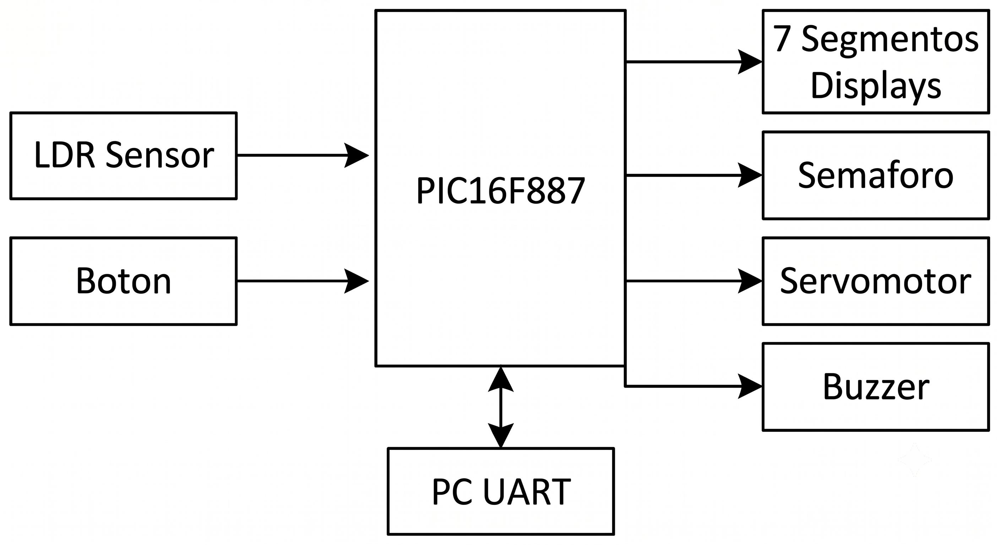
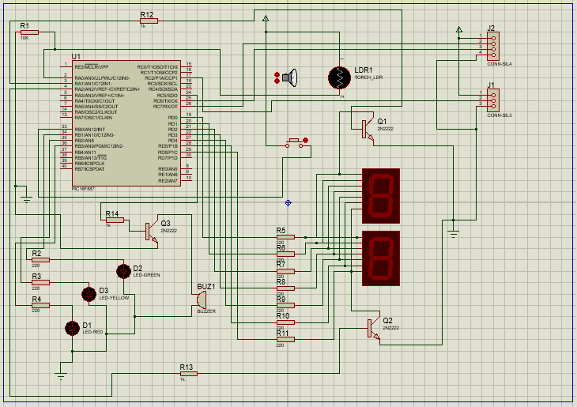
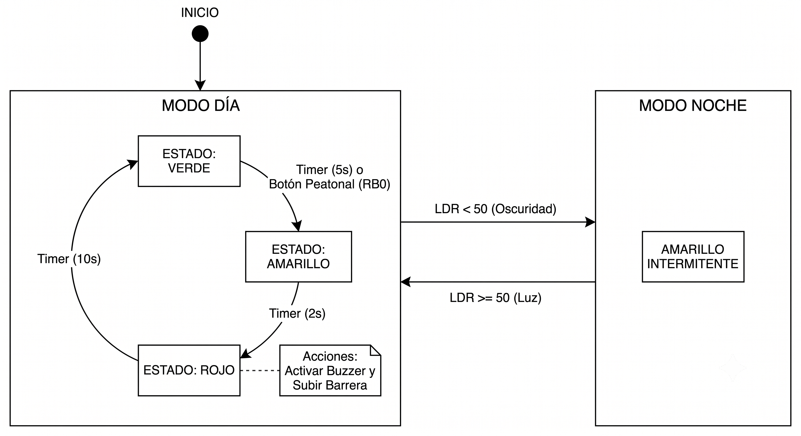
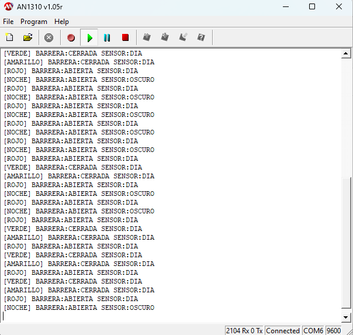
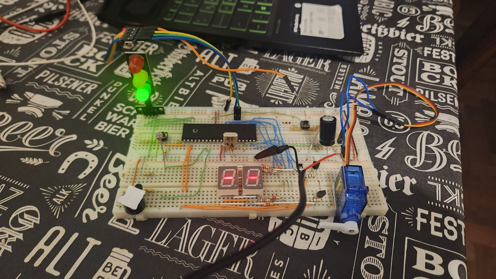
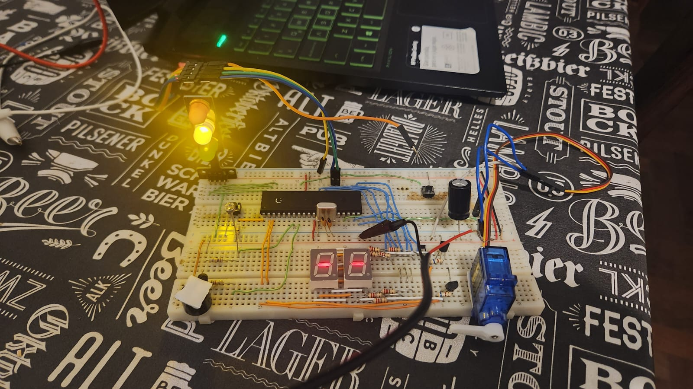
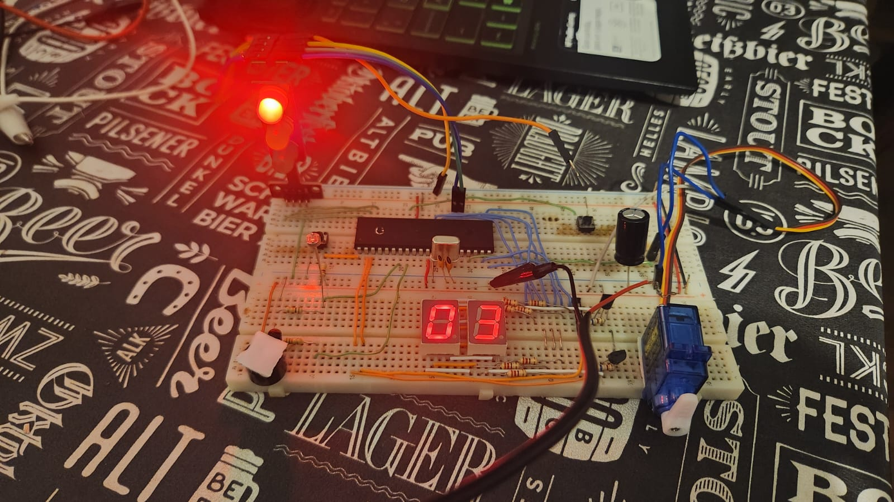
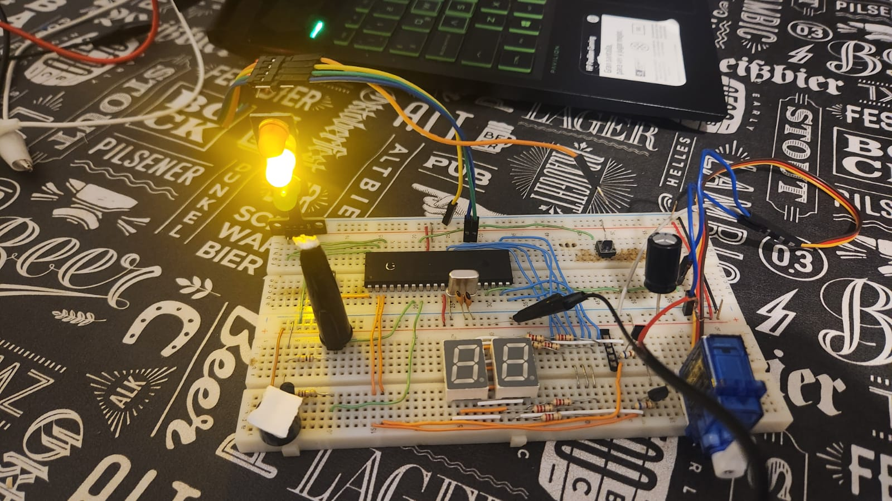

# Proyecto Final: Semáforo Inteligente Interactivo

**Asignatura:** Electrónica Digital II - Universidad Nacional de Córdoba 

**Integrantes:**
Valentino Isola 
Manuel Giordano 
Leandro Agustín Rocatagliatta 
**Profesor:** Ing. Blasco  

---

## 🚀 1. Descripción General del Proyecto

Este proyecto consiste en el diseño e implementación de un sistema de tránsito automatizado basado en el microcontrolador PIC16F887 y programado en lenguaje Assembler. El sistema simula un semáforo de dos vías: una vía vehicular regulada por una secuencia de luces (Verde, Amarillo, Rojo) acoplada a una barrera física, y una vía de cruce peatonal que asiste a personas mediante alertas sonoras y temporizadores visuales.

El dispositivo resuelve la necesidad de adaptabilidad vial y seguridad en cruces urbanos complejos. Integra automatización por hardware para conmutar dinámicamente entre el régimen diurno convencional y un modo nocturno intermitente de precaución mediante la medición de luz ambiental con un sensor LDR acoplado al conversor analógico-digital (ADC). Está dirigido a entornos urbanos de alto trafico y concurrencia peatonal.

### 🎯 Alcances del Proyecto

### El sistema SÍ es capaz de:
* **Gestionar una máquina de 4 estados:** Controla de manera sincronizada las luces vehiculares para los estados Verde, Amarillo, Rojo y Noche.
* **Interrumpir la secuencia vehicular:** Mediante un botón peatonal conectado por hardware al pin RB0, el sistema detecta la pulsación por interrupción externa y fuerza de manera inmediata la transición para permitir el cruce seguro.
* **Controlar una barrera automatizada:** Utiliza un servomotor mapeado en una salida digital gestionada por software, el cual posiciona la barrera alta durante los estados Rojo y Noche, y la mantiene baja en Verde y Amarillo.
* **Cuenta regresiva visual:** Implementa dos displays de 7 segmentos compartidos en PORTD y multiplexados para mostrar el tiempo restante en el estado Rojo o guiones de espera (`--`) en Verde y Amarillo.
* **Emitir asistencia sonora:** Activa un buzzer acoplado a una salida digital sincronizado intermitentemente cada vez que el semáforo se encuentra en el estado Rojo diurno.
* **Monitorear la luz ambiente automáticamente:** Realiza lecturas constantes a través del ADC conectado al LDR, aplicando lógica de comparación con un umbral digital de 8 bits para pasar a modo Noche o retornar al modo Día.
* **Transmitir telemetría serial e interactuar vía comandos:** Configura la UART a 9600 baudios para enviar de forma automática reportes textuales del estado actual de las luces, la barrera y el sensor hacia una PC, además de permitir la detección de la pulsación del botón peatonal.

### El sistema NO incluye (Fuera de alcance):
* Almacenamiento local de logs o registro histórico de eventos en memorias EEPROM externas.
* Conectividad inalámbrica para el monitoreo a distancia a través de redes de internet.
* Regulación adaptativa de la velocidad o movimeinto de la barrera.
* Deteccion y monitoreo de fallas o conflictos: El sistema no cuenta con mecanismos de diagnóstico en tiempo real para detectar errores de software o hardware en las transiciones.
* Control adaptativo o dinámico de tráfico: La máquina de estados opera con una base de tiempos rígida y predeterminada en el código
### ⏩ Posibles Etapas Siguientes (Líneas Futuras)

* **Optimización por Hardware de Periféricos:** Reemplazar el control del servomotor (actualmente basado en retardos bloqueantes de software como `DELAY_1MS` y `DELAY_2MS`) por los módulos CCP/PWM integrados por hardware del PIC16F887.
* **Señalización Peatonal Simbólica:** Evolucionar los displays numéricos de 7 segmentos actuales hacia matrices de LED o indicadores gráficos que muestren símbolos normativos dinámicos de tránsito pedestre, tales como una silueta humana en movimiento.
* **Control Bidireccional Avanzado por UART:** Expandir la lógica de recepción serial para que el operador no solo pueda consultar el estado del PIC o simular el botón, sino también reconfigurar dinámicamente en tiempo real los tiempos base de la secuencia vehicular (Verde, Amarillo, Rojo) o forzar estados de emergencia de forma remota.
* **Modo Nocturno de Bajo Consumo Inteligente:** Adaptar una rutina de ahorro energético basada en la instrucción `SLEEP` del microcontrolador que se active durante el estado nocturno; el sistema despertaría de forma cíclica mediante desbordes del Watchdog Timer (WDT) o interrupciones del Timer para generar el titilado amarillo intermitente, reduciendo drásticamente el consumo promedio de potencia.
* **Cumplimiento de Normativa Vial y de Seguridad:** Investigar y adecuar el diseño para cumplir con normativas de seguridad vial y señalización urbana, asegurando tiempos de despeje mínimos obligatorios, redundancias de hardware ante fallas de lámparas y protección contra tensiones peligrosas para los usuarios.
* **Fiscalización Electrónica Integrada:** Incorporar sensores de velocidad de efecto Doppler junto a módulos de captura de imágenes para detectar y registrar automáticamente vehículos que excedan los límites de velocidad o crucen con la señal de luz roja encendida.

  ---
## 📐 2. Arquitectura del Sistema: Hardware y Software (Común)

### 🔌 Hardware & Interconexión

* **Diagrama de Bloques:** 

* **Esquemático del Circuito:** 

* **Descripción del Circuito y Consideraciones de Diseño:** El hardware se centra en un PIC16F887. La etapa de entrada del sensor cuenta con un divisor de tensión con un LDR para adaptar el rango dinámico de luz al ADC (0-5V), y tenemos un botón peatonal como otra entrada conectada a RB0. Para las etapas de salida de potencia, se implementaron transistores NPN (2N2222) operando en corte y saturación: dos para habilitar los cátodos comunes en el multiplexado de los displays, y uno para aislar el consumo de corriente del Buzzer (alimentado directo a VCC). Las señales lógicas de los LEDs y el PWM del servomotor se manejan directamente desde los pines del microcontrolador con sus respectivas resistencias limitadoras de corriente.

### 💻 Arquitectura de Software (Firmware)

* **Diagrama de Flujo o Máquina de Estados:** 

---

## ⚡ 3. Especificaciones Eléctricas, Alimentación y Entorno

### 🔌 Parámetros de Alimentación y Consumo

* **Tensión de operación del sistema:** 5 VCC.
* **Método de alimentación:** Fuente de corriente continua externa de 5V, inyectada de forma directa a las líneas de alimentación principal de la placa de desarrollo (VCC y GND).
* **Rango lógico de señales:** Umbral de tensión digital de 0V a 5V.
* **Consumo estimado del sistema:**
  * **En modo activo :** ~240 mA (Cálculo estimado basado en el encendido simultáneo de: 1 LED indicador a ~15mA, 2 displays multiplexados a ~40mA en picos de encendido de segmentos, el consumo estático del PIC16F887 a 4MHz de ~5mA, picos de corriente del servomotor SG90 en movimiento de ~150mA, y el buzzer piezoeléctrico activo a ~30mA).

### 📌Parametros propios de la materia

* **Herramientas de Software:** MPLAB X IDE v5.35 para la escritura del código fuente en lenguaje Assembler, y la aplicación de Microchip
  AN1310 High-Speed Bootloader para la transferencia directa del firmware vía puerto serie.
* **Hardware de Programación/Depuración:** Módulo convertidor USB a TTL. La grabación de la memoria Flash del PIC se realiza sin necesidad de programadores dedicados (como PICkit), aprovechando un firmware *Bootloader* residente en las líneas de transmisión y recepción serie (`TX` en RC6 y `RX` en RC7).
* **Configuración de Bits (Fuses Críticos):**
  * **Oscilador (`_XT_OSC`):** Configurado para oscilador de cristal de cuarzo externo acoplado a los pines OSC1/OSC2 (frecuencia de trabajo de 4 MHz).
  * **Watchdog Timer (`_WDT_OFF`):** Desactivado por hardware para evitar reinicios cíclicos involuntarios durante la ejecución de bucles de temporización largos.
  * **Master Clear (`_MCLRE_ON`):** Activado el pin de reset externo (RE3/MCLR), asegurando la capacidad de reiniciar físicamente el circuito de forma manual.
  * **Low Voltage Programming (`_LVP_OFF`):** Desactivado para liberar el pin RB3 para funciones de propósito general e impedir grabaciones accidentales por baja tensión.
  * **Power-up Timer (`_PWRTE_ON`):** Activado para asegurar un retardo de encendido controlado mientras la fuente de alimentación externa estabiliza su voltaje en 5V.

* **Periféricos Internos Utilizados:**
  * **Timer0:** Configurado con preescaler asignado  en relación 1:256 para generar la base de tiempos periódica mediante interrupción por desborde. Es el encargado de administrar el multiplexado de los displays y el decremento del reloj de segundos.
  * **Conversor Analógico-Digital (ADC):** Configurado a 8 bits de resolución (justificación a la izquierda), utilizando el canal `AN4` para leer la tensión analógica variable provista por el divisor resistivo del sensor LDR.
  * **EUSART (UART):** Periférico de comunicación serie configurado en modo asincrónico a 9600 baudios, 8 bits de datos, sin paridad y 1 bit de parada para telemetría.
  * **Puerto B (Interrupción por Cambio de Estado):** Configurado específicamente en el pin `RB0/INT` para capturar de forma inmediata el flanco de bajada provisto por la pulsación del botón de demanda peatonal.

* **Gestión de Interrupciones y Prioridad por Software (Polling):**
  Al contar el PIC16F887 con un único vector de interrupción por hardware ubicado en la dirección de memoria `0x04`, la discriminación de los eventos se resuelve mediante una estructura de prioridad por software (Polling) evaluando secuencialmente las banderas (*flags*) dentro de la Rutina de Servicio de Interrupción (ISR):

  1. **Primera prioridad - Interrupción Externa (`INTF` en INTCON):** Se evalúa en primer lugar la bandera del botón peatonal conectado a `RB0`. Al ser un dispositivo de seguridad crítica vial (paso de peatones), requiere la atención inmediata del procesador para interrumpir el flujo normal vehicular, forzando la transición rápida al estado de cruce seguro.
  2. **Segunda prioridad - Desborde de Timer0 (`T0IF` en INTCON):** Se evalúa inmediatamente después. Al estar encargado de tareas repetitivas de refresco visual en los displays de 7 segmentos.

 ---
  
## 🔄 4. Proceso de Integración y Desarrollo

Etapa 1 (Validación inicial): Configuración base, puertos y tiempos:
  * Configuración del oscilador y Timer0: Se configuró el oscilador interno a 4 MHz para obtener un ciclo de instrucción de 1 µs. Se implementó el Timer0 con reloj interno y prescaler 1:256. Se calibró la carga del TMR0 con el valor 237 para generar un desbordamiento exacto cada 4.8 ms. Contando 206 de estas interrupciones se consiguio 1 segundo para el contador del semáforo.
  * Asignación de puertos: Se definieron las entradas y salidas básicas del sistema configurando los registros `TRISA` (LDR y transistores multiplexado), `TRISB` (RB0), `TRISC` (UART y servomotor), `TRISD` (Display) y `TRISE` (Buzzer).

Etapa 2 (Adquisición/Comunicación): Sensores, interrupciones externas y UART:
  * Conversión LDR (ADC): Se implementó el uso del canal AN0 del conversor ADC para medir automáticamente la luz ambiente con un valor de 8 bits. Esta lectura se ejecuta y verifica continuamente en el bucle principal (PROGRAMA_PRINCIPAL y ESPERA_ADC).
  * Interrupción por hardware (RB0): Se conecto un botón al pin RB0 para utilizar su interrupción externa (INTF).
  * Comunicación Serie (UART): Se implementó la transmisión y recepción por consola configurando la UART a 9600 baudios. Se desarrollaron las rutinas de transmisión de cadenas de caracteres para visualizar tramas de estado completo como `[VERDE] BARRERA:CERRADA SENSOR:DIA`.

Etapa 3 (Integración lógica): Máquina de estados y Concurrencia (Main Loop + ISR):
  * Arquitectura: La lógica se montó sobre una arquitectura dual combinando un programa principal en bucle y una Rutina de Servicio de Interrupción (ISR) generada por el Timer0 o RB0.
  * Lógica del semaforo (Máquina de estados): Se programó una máquina con 4 estados definidos: Verde (0x00), Amarillo (0x01), Rojo (0x02) y Noche (0x04). Se implementó la lógica de transición decrementando la cuenta regresiva e iterando sobre la secuencia de dia (verde → amarillo → rojo → verde) o pasando al parpadeo amarillo nocturno.
  * Multiplexado de displays: Aprovechando la rutina de interrupción (ISR) de 4.8 ms, se integró el encendido de los dos displays de 7 segmentos. Se habilitan secuencialmente las unidades y decenas a una velocidad justa para ver ambos encendidos de forma continua.

Etapa 4 (Sistema Completo): Acople de actuadores finales, calibración y pruebas:
  * Actuadores (Servo y buzzer): Se sumó un servomotor conectado como salida digital normal usando bucles de retardo calibrados por software (1ms, 2ms, 18ms, 19ms) para emular el PWM y lograr los grados exactos de apertura y cierre de la barrera. También se acopló un buzzer en RC5.
  * Calibración: el umbral en el cual el programa detecta que es de noche es cuando la lectura del ADC es mnor a 50, se toma de 0v a 5v de la entrada del LDR y se considero un 20% para considerar que se active el modo noche.
  * Pruebas de estrés e integración final: El resultado de la integración demostró que el enfoque concurrente fue exitoso. El sistema logró atender simultáneamente el multiplexado de la pantalla, la modulación del buzzer, la conversión del LDR y la comunicación UART interactiva sin que los retardos afectaran la sincronía del semáforo

---

 ## 📊 5. Ensayos, Pruebas y Resultados

Para garantizar la estabilidad y el correcto funcionamiento del semáforo inteligente, se llevaron a cabo una serie de ensayos empíricos de puesta en marcha, divididos en pruebas de hardware y pruebas de software.

1. **Ensayo de Integridad Eléctrica y Continuidad:** Antes de energizar el circuito por primera vez, se utilizó un multímetro digital en modo continuidad para verificar la ausencia de cortocircuitos entre las líneas principales de alimentación. Asimismo, se constató la correcta continuidad del cableado desde los pines del PIC16F887 hacia los periféricos críticos (módulo USB-TTL, displays de 7 segmentos y servomotor).
2. **Validación de Tensiones de Alimentación:**
   Con el circuito energizado mediante la fuente externa de 5V, se midieron los niveles de tensión estática en los nodos principales. Se constató un valor estable de 5V en las pistas de la protoboard y directamente entre los pines de alimentación del microcontrolador, manteniéndose dentro de los márgenes de operación y garantizando una referencia correcta para las lecturas analógicas del ADC acoplado al LDR.
3. **Monitoreo y Diagnóstico por Telemetría Serie (UART):**
   Se validó la correcta configuración del módulo EUSART y la lógica del programa en Assembler conectando el PIC a la PC mediante la interfaz USB-TTL. Utilizando la consola del software del Bootloader (AN1310), se verificó la recepción en tiempo real de las tramas de texto automáticas emitidas por el sistema en cada cambio de estado (reportando el color activo, posición de la barrera y modo Día/Noche), confirmando el envio de estados y la correcta decodificación de caracteres.

### 📸 Evidencia fotográfica y gráficos
A continuación, vamos a mostrar imagenes del circuito final en sus 4 estados posible.

  * 0x00 Verde: Se enciende el led de color verde durante 5 segundos, el buzer se encuentra apagado, los display muestran dos guiones (--), la barrera se encuentra baja y se envia estado a la UART.
  * 0x01 Amarillo: Se enciende el led de color amarillos durante 2 segundos, el buzer se encuentra apagado, los display muestran dos guiones (--), la barrera se encuentra baja y se envia estado a la UART.
  * 0x02 Rojo: Se enciende el led de color rojo durante 10 segundos, el buzer se encuentra encendido, los display muestran el tiempo restante, la barrera se encuentra alta y se envia estado a la UART.
  * 0x04 Noche: Se enciende el led de color amarillo de manera intermitente durante tiempo indefinido, el buzer se encuentra apagado, los display se encuentran apagados, la barrera se encuentra alta y se envia estado a la UART.

 
 
